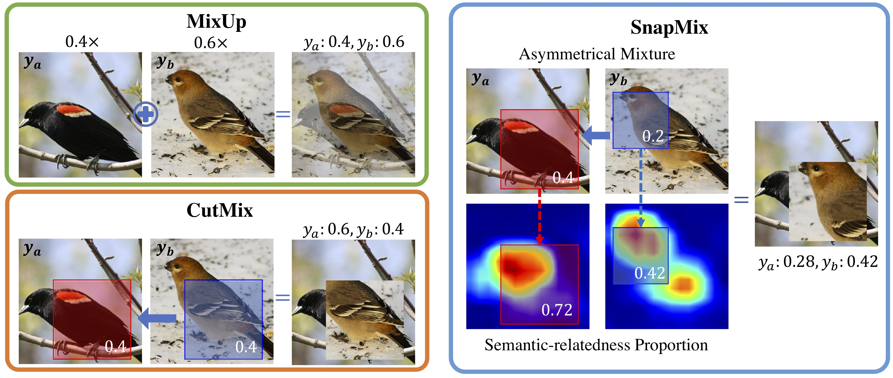

# SnapMix: Semantically Proportional Mixing for Augmenting Fine-grained Data (AAAI 2021)

Official PyTorch implementation of SnapMix | [paper](https://)

## Method Overview



# Setup

### Install Package Dependencies
```
Python Environment: >= 3.6
torch = 1.2.0
torchvision = 0.4.0
scikit-learn >= 0.2
tensorbard >= 2.0.0
```
